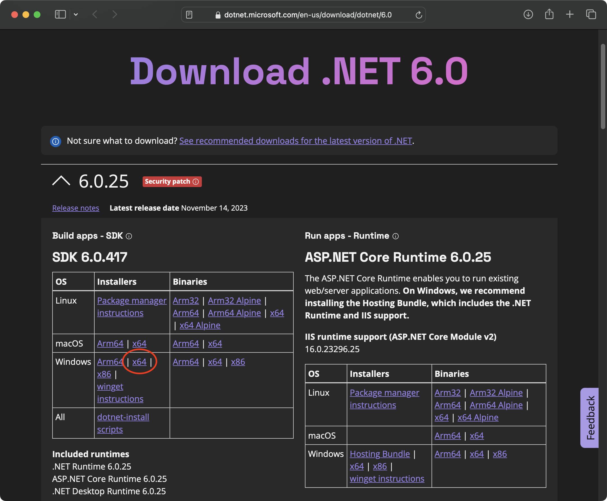
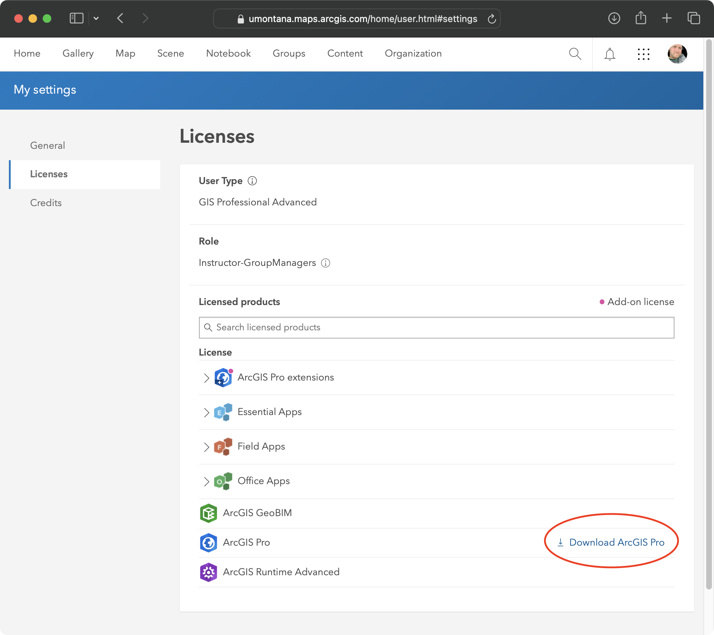

## Before you Install:

[Check that you computer meets the minimum system requirements](https://arcgis.pro/arcgis-pro-system-requirements/). If you followed the instructions for setting up Windows using UTM in either MacOS ([Apple Silicon](/Installation/mac_apple_silicon.html) or [Intel](/Installation/mac_intel.html)), you should be good to go. **Be sure you are working within your Windows virtual machine for the following steps.**

## Install .NET SDK 6.0 (x64)

ArcGIS Pro requires .NET SDK 6.0 for x64 processors. **The presence of Microsoft .NET Desktop Runtime 7 or for any other architecture is inconsequential.**

Follow these instructions to install the correct .NET SDK.

1.  Open a browser and navigate to [https://dotnet.microsoft.com/en-us/download/dotnet/6.0](https://dotnet.microsoft.com/en-us/download/dotnet/6.0){target="_blank"}.

2.  You will see a grid of options for installing the .NET SDK. Under the **Installers** column and **Windows** row, click the **x64** link to begin the download.

    {width="60%"}\

3.  Navigate to the downloaded file, and double click to begin the installation process. Follow the instructions in the installer, accepting all defaults.

4.  **Restart the Windows VM.**

## Install ArcGIS Pro

1.  Download the ArcGIS Pro installer.

    -   Navigate to [https://umontana.maps.arcgis.com](https://umontana.maps.arcgis.com){target="_blank"} and click **Sign In** in the upper right. You will be prompted to sign in with your UM NetID.

    -   Click your name in the upper right and go to **My Settings \> Licenses**. On the list of product licenses, you'll see a Download link for ArcGIS Pro. Click it to start the download.

        {width="60%"}\

2.  Launch the downloaded installer, and follow the on-screen instructions to install ArcGIS Pro.

## Activate ArcGIS Pro

1.  Launch ArcGIS Pro.

2.  At the sign on page, click **Your Organization’s URL**.

3.  In the empty field, enter **umontana** so the URL completes to [**umontana.maps.arcgis.com**](https://umontana.maps.arcgis.com){target="_blank"}.

    [**Do not enter anything other than “umontana”**.]{style="color:red"} Anything else simply won't work.

4.  Click **Continue**, then click the **UM NetID** button.

5.  Sign in with your NetID and password at the UM NetID SSO page. Activation should happen automatically.
